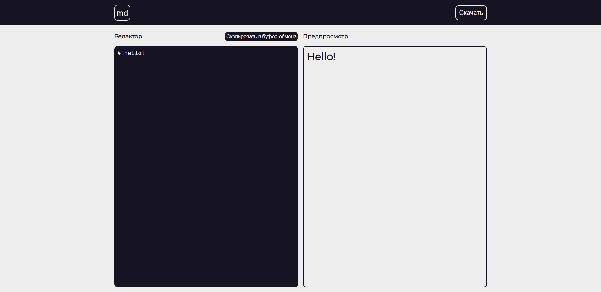

# Markdown editor

Minimalistic markdown editor on React. [Demo](https://daniilsintsov.github.io/markdown-editor/)

## Screenshot

## Features

+ Full Markdown supports with [marked](https://marked.js.org/)
+ Code highlighting with [prismjs](https://prismjs.com/)
+ Copying markup to the clipboard
+ Downloading a document with markup in *.md* format
+ Custom scrollbar with [simplebar-react](https://github.com/Grsmto/simplebar/tree/master/packages/simplebar-react)
